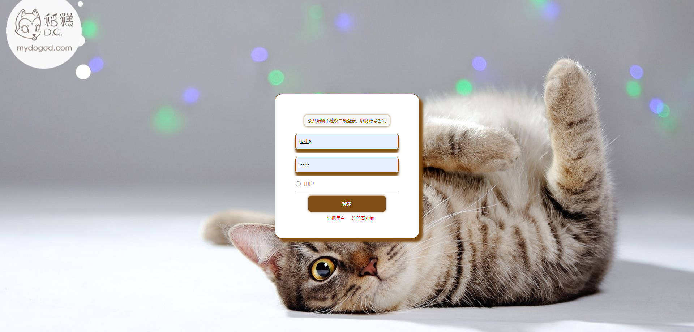
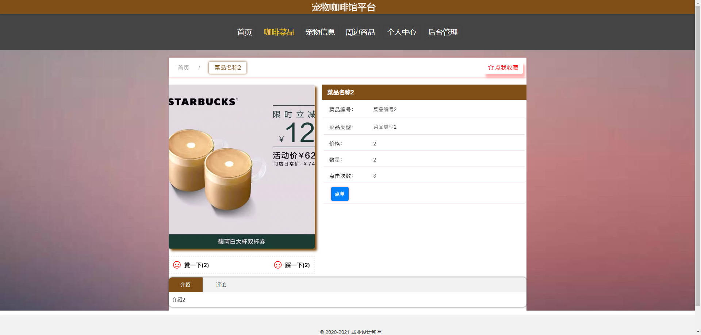

# 基于Springboot的宠物咖啡馆平台

## Springboot-0053


## 技术栈

Springboot mybatisplus vue mysql maven


## 数据库表(23张)


## 功能介绍

```properties
用户功能有个人中心，咖啡菜品管理，菜品订单管理，宠物信息管理，宠物体验管理，宠物订单管理，宠物寄养管理，健康状况管理，看护服务管理，周边商品管理，商品购买管理，我的收藏管理等。管理员功能有个人中心，用户管理，看护师管理，咖啡菜品管理，菜品类型管理，菜品订单管理，宠物信息管理，宠物体验管理，宠物订单管理，宠物寄养管理，健康状况管理，互动项目管理，看护服务管理，周边商品管理，商品类型管理，商品购买管理，商品入库管理，系统管理等。看护师功能有个人中心，宠物体验管理，宠物寄养管理，健康状况管理，看护服务管理等。
```


## 图片

### 前台







### 后台


## 访问路径

### 前台

```properties
http://localhost:8080/springbootx9rzc/front/pages/login/login.html

账号 001
密码 001
```

### 后台

```properties
http://localhost:8080/springbootx9rzc/admin/dist/index.html#/login

账号 abo
密码 abo
```


## 功能图


## 文档目录


## 打赏或交流


